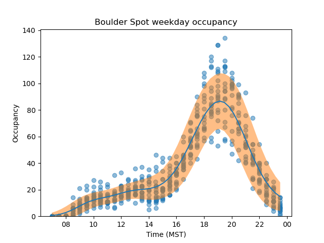

```python
import SpotOccupancy.predict as predict
import matplotlib.pyplot as plt
when = 'weekday'
data = predict.FlattenedOccupancy(when=when)
pred = predict.OccupancyPredictor(data, 0.05)
fig, ax = pred.plot()
plt.xlabel("Time (MST)")
plt.ylabel("Occupancy")
plt.title(f"Boulder Spot {when} occupancy")
plt.show()
```


